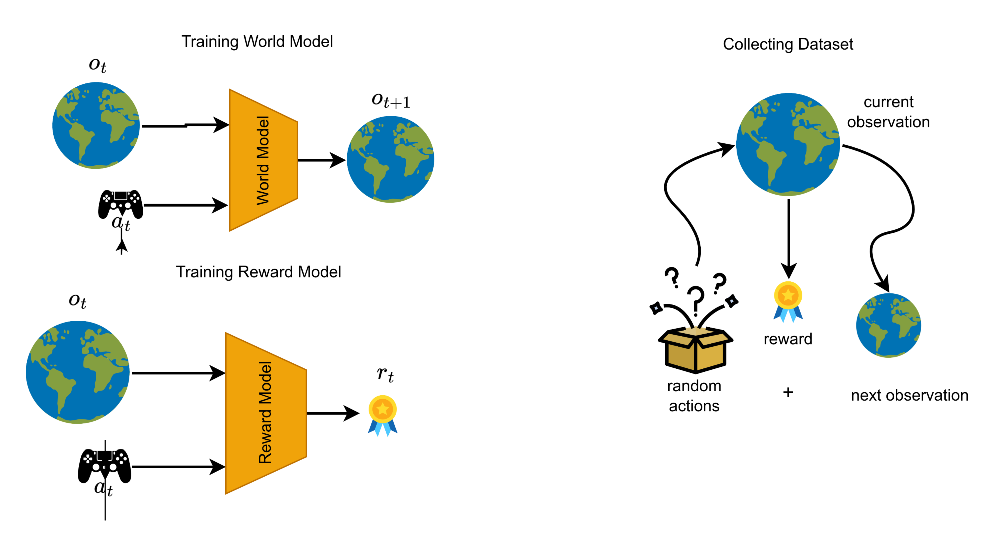
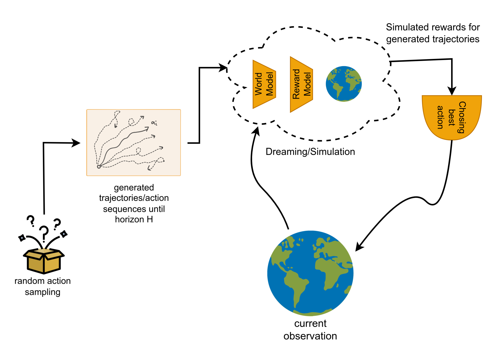
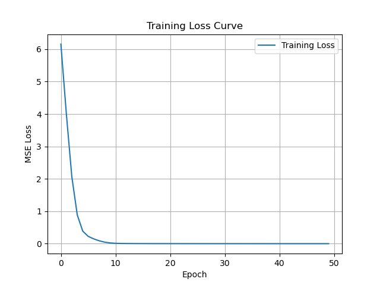
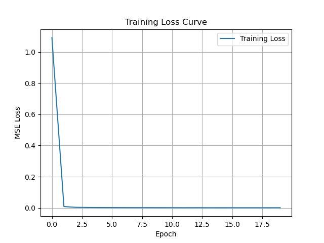

# Evaluating Model Based Deep RL on Continuous and Discrete Action spaces

## Abstract
It is believed that Traditional TD based approach for RL suffers from sample ineffiency. To solve this issue, it is theoretically believed that the model based approach of 'planning' the action sequences (trajectories) and get the approximate reward by forward simulating (or dreaming) can solve this problem. In this project, we attempt to see how the model based approach performs for continuos and discrete action spaces. 

We evaluate two strategies:  
1. Pre-Trained World and Reward model with Randomized Action planning
2. TD-MPC approach. 

We implemented the two strategies on two different environments.
1. Control systems environment for continuous action space.
2. Atari games environment for discrete action space.

TD-MPC approach is defined for continuous action spaces and we implemented 'insert needed term' to convert continous action sequence to discrete one.

## Methods explored

### Pretrained Model with Random Shooting
In this approach, we try to train two models needed for simulation (or dreaming), namely the world model and reward model.
- World Model : Predicts the next observation based on current observation and action performed.

- Reward Model : Predicts the reward to be obtained if we perform given action on current observation.

Both World and Reward model are simple CNNs for atari and MLP for control environments, which map from observation space to observation space and observation space to reward respectively.

The collection of dataset to train these model is done by interacting with gym enivronment using random sampling of actions. We make the dataset by collecting the $(o_t, a_t, r_t, o_{t+1})$
where:
- $o_t$ : current observation
- $a_t$ : action performed
- $r_t$ : reward from gym env
- $o_{t+1}$ : next observation

The inference methodology is the following:
1. Create trajectories (multiple action sequences) with certain horizon.

2. Evaluate the trajectories by accumulating rewards using simulation via world and reward model.

3. We argmin or argmax the reward to get the best action sequence and choose the first action as the best action.

4. Perform the best action on environment and repeat from step1, using next observation.

Training of Pretrained Models

Inferencing using simulation using random action sampling.

For training pretrained models for atari games has some changes for world model (reward model remains same) is done using auto-encoding approach.

1. Encoder
A CNN that takes in a 4-frame stacked Atari observation (shape: 4×84×84) and Outputs a latent vector: $z_t = encoder(state_t)$

2. Action Conditioning
Convert action (e.g. 0–5 in Pong) to a one-hot vector
Concatenate with the latent state $z_t$

3. Transition Model
A feedforward MLP that takes $z_t$ and action, and outputs a prediction $ẑ_{t+1}$ of the next latent

4. Decoder
A CNN that takes $ẑ_{t+1}$ and reconstructs $state_{t+1}$ (i.e., the next frame stack)

5. Computing Loss
Compute loss between $statê_{t+1}$ and actual $state_{t+1}$ using Mean squared error loss.

### TD-MPC approach
@TODO: by subhojeet or eshwar

## Experiments and Videos

Experiments performed using pretrained model and random sampling`
### Pendulum

World model loss curves:  

Reward model loss curves:  

Videos on pendulum

](https://raw.githubusercontent.com/gokulkrishna98/DeepRL_proj_website/main/videos/ptm_pendulum.mp4)

]

### LunarLander

### Atari 

## Videos
### Pre-Trained models with random shooting
- LunarLander
- Pendulum
- Atari

### TD-MPC approach
- LunarLander
- Pendulum
- Atari (with discrete -> continuous modification)

## Observation and conclusions
@TODO: (We will do it on wednesday)
- Reward curves
- Possible reasons for failure and performance. 

@TODO: (We will do it on wednesday)
What we learnt from the experiments and what couldve been done.